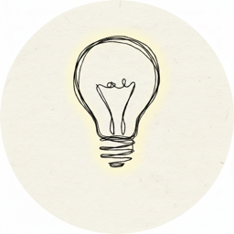

<div align="center">



# ClaudeNotch

**Monitor your Claude Code sessions from the MacBook notch.**

[](https://swift.org/)
[](https://developer.apple.com/macos/)
[](https://github.com/RedHiwiK/hk-claude-notch/releases)
[](LICENSE)


</div>

A native macOS menu bar app that displays real-time Claude Code CLI session status in the MacBook notch area (Dynamic Island style). Powered by [DynamicNotchKit](https://github.com/MrKai77/DynamicNotchKit).

### Features

| Feature | Description |
|---------|-------------|
| **Notch Status Display** | Compact mode shows active/total session count + pulsing status indicator |
| **Expandable Session List** | Hover to expand and see all sessions with project name, tool name, and status |
| **Click to Expand Details** | Click any session row to reveal full command text / file paths |
| **One-Click Approval** | Approve permission prompts directly from the notch — no need to switch windows |
| **Jump to iTerm** | Open the corresponding iTerm tab for multi-option approval scenarios |
| **Smart Sorting** | Sessions sorted by priority: pending approval > running > thinking > idle > ended |
| **5+ Session Support** | Collapsible list with "show more" for heavy multitaskers |
| **Cute Mascot** | Animated face that bounces when active, blinks randomly, and changes expression by status |
| **Zero Config** | One install script sets up everything |

### How It Works

```
Claude Code Sessions (1..N)
    │  Hooks write JSON on each event
    ▼
~/.claude/notch-monitor/sessions/{session_id}.json
    │  FSEvents directory watching
    ▼
ClaudeNotch App → Notch UI
```

**Session statuses:** Started → Thinking → Tool Running → Tool Completed → Idle → Ended

### Install (DMG)

1. Download the latest `ClaudeNotch.dmg` from [Releases](https://github.com/RedHiwiK/hk-claude-notch/releases)
2. Open the DMG and drag **ClaudeNotch.app** to `/Applications`
3. Remove macOS quarantine (the app is not code-signed):
```bash
xattr -cr /Applications/ClaudeNotch.app
```
4. Open ClaudeNotch from Applications (hooks are installed automatically on first launch)
5. Restart your Claude Code sessions to activate hooks

### Build from Source

Requires Swift 6.0+ toolchain.

```bash
git clone https://github.com/RedHiwiK/hk-claude-notch.git
cd hk-claude-notch

# Build & install hooks
swift build
./hooks/install.sh

# Run
swift run ClaudeNotch
```

### Prerequisites

- macOS 14+ (Sonoma or later)
- [Claude Code CLI](https://docs.anthropic.com/en/docs/claude-code) installed
- `jq` recommended (`brew install jq`), falls back to Python 3

### Menu Bar Controls

| Action | Description |
|--------|-------------|
| **Show Notch** (⌘S) | Expand the notch to show full session list |
| **Hide Notch** (⌘H) | Hide the notch display |
| **Quit** (⌘Q) | Exit ClaudeNotch |

### Status Colors

| Color | Status |
|-------|--------|
| 🔵 Blue | Session started |
| 🟣 Purple | Claude is thinking |
| 🟠 Orange | Tool is running |
| 🟢 Green | Tool completed |
| 🟡 Yellow | Pending approval |
| ⚪ Gray | Idle (waiting for input) |
| 🔴 Red | Error |

### Project Structure

```
claude-notch/
├── Package.swift                    # SPM config, depends on DynamicNotchKit
├── Sources/ClaudeNotch/
│   ├── App/                         # App entry + AppDelegate
│   ├── Models/                      # SessionState, SessionManager
│   ├── Views/                       # NotchContent, SessionList, Mascot, etc.
│   └── Services/                    # FileWatcher, NotchController, ApprovalService
├── hooks/                           # Claude Code hook scripts + installer
└── scripts/                         # Build & packaging scripts
```

### Hook Events

| Event | Trigger | Status Written |
|-------|---------|----------------|
| `SessionStart` | Claude Code session begins | `started` |
| `PreToolUse` | Before a tool executes | `tool_running` |
| `PostToolUse` | After a tool completes | `thinking` |
| `Notification` | Permission prompt received | `pending_approval` |
| `Stop` | Claude finishes responding | `completed` |
| `SessionEnd` | Session exits | File deleted |

